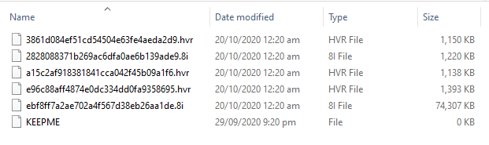

============================================================
Troubleshooting
============================================================

There's no 8i holograms can be seen in the packaged build
------------------------------------------------------------

Make sure you ``cooked`` the contents. This is a separated process from Unreal Engine's cooking, and it can be done by clicking the big 8i logo on the main toolbar and choose ``Rebuild 8i Contents``, before building or packaging the game. In your final game, you should see an ``8iCooked`` folder, with files like this:

